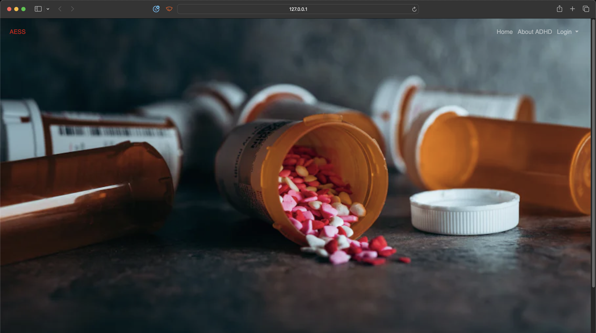
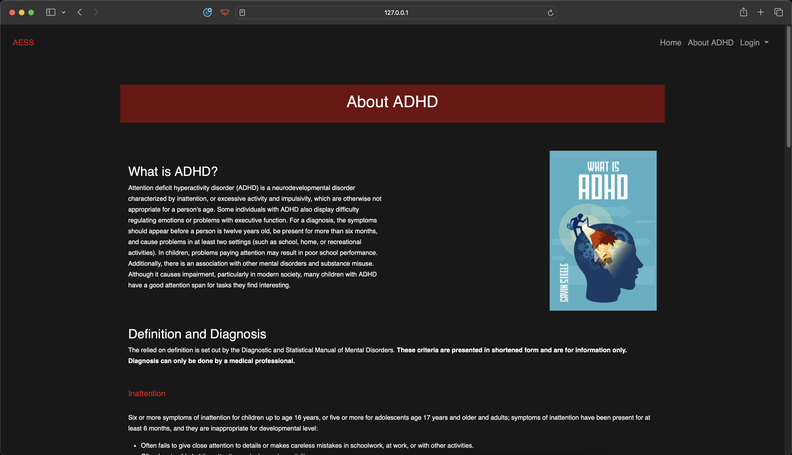
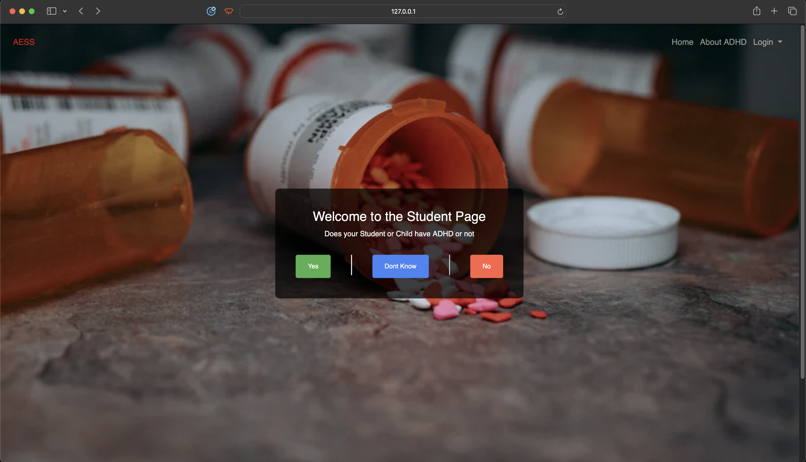
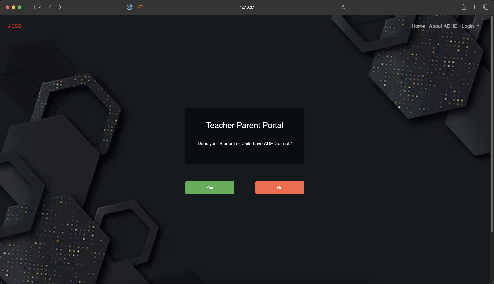
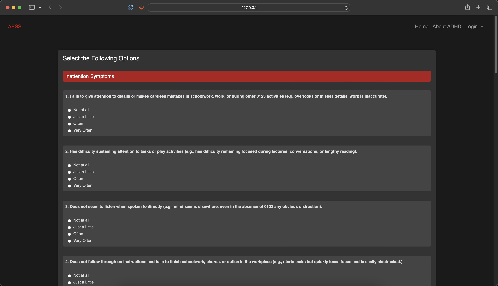
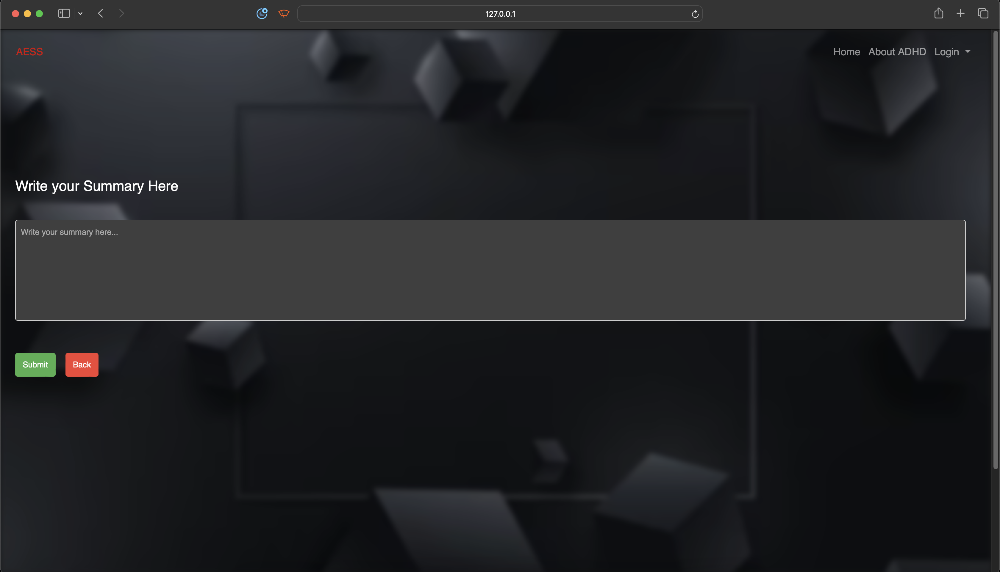

# Automated-Evaluation-of-Student-Summaries-A-Learning-Aid

<p align="center">
  
</p>

Data Science project using transformers to evaluate summaries written by students with ADHD and normal students

## About The Project

This project addresses the academic challenges faced by children, particularly those diagnosed with Attention Deficit Hyperactivity Disorder (ADHD), in grades 3 through 12. The research delves into issues such as summarization difficulties, impulse control, mental organization, and concentration. Leveraging sophisticated summary scoring algorithms and Large Language Models (LLMs), the study aims to improve summarizing skills in both ADHD-diagnosed and neurotypical students. The overarching goal is to enhance student engagement, boost self-confidence, and improve academic outcomes, while also bridging the EDTech gap for educators and students.

## Objectives

1. Explore and understand the academic challenges faced by children with ADHD.
2. Develop and implement contemporary instructional practices using advanced summary scoring algorithms and LLMs.
3. Improve summarizing skills to benefit both ADHD-diagnosed and neurotypical students.
4. Provide educators and students with a specialized evaluation tool to address academic challenges.
5. Contribute to inclusive education by leveraging technology to support students with diverse neurological profiles.

## Built With

- [](https://pytorch.org/)
- [](https://flask.palletsprojects.com/)

## Getting Started

To get a local copy up and running follow these simple steps.

### Prerequisites

1. This project requires Python version 3.9.18

### Installation

1. Clone the repository:
   ```sh
   git clone https://github.com/tkarim45/Automated-Evaluation-of-Student-Summaries-A-Learning-Aid.git
   ```
2. Install teh required packages:
   ```sh
   cd Automated-Evaluation-of-Student-Summaries-A-Learning-Aid
   pip install requirements.txt
   ```

### Usage

Use the following command in the project directory to start the application:

- To run the frontend type the following copmmand in the terminal:
  ```sh
  python app.py
  ```

## Front end

The project's frontend, developed using HTML, CSS, and JavaScript, is part of a study addressing academic challenges faced by children, especially those with ADHD. It focuses on enhancing summarizing skills through advanced algorithms and LLMs, aiming to improve engagement and academic outcomes. The project seeks to bridge the educational technology gap and promote inclusive education by providing a specialized evaluation tool for both ADHD-diagnosed and neurotypical students.



## About Page

The About Page serves as a gateway to understanding the essence of our project. Designed with simplicity and clarity, it offers a concise overview of our mission—addressing academic challenges for children, specifically those with ADHD. Delve into our use of HTML, CSS, and JavaScript in creating an engaging frontend. Explore how advanced algorithms and LLMs form the backbone of our efforts to enhance summarizing skills, fostering inclusive education and academic success for all students. Join us on this transformative journey as we bridge the educational technology gap and champion a brighter future for learners.



## Student Portal

The Student Portal is a dynamic platform where students, parents, and teachers can actively engage in understanding and addressing ADHD-related challenges. With the capability to administer quizzes, users can assess whether a student may be experiencing symptoms of ADHD. Once the assessment is completed, the portal seamlessly directs them to an individualized page where they can delve into the process of writing summaries tailored to the specific needs of the student. This interactive feature empowers users with insights into ADHD diagnosis while providing a dedicated space for honing summarization skills, fostering a collaborative and supportive educational environment.




## Teacher Portal 

The Teacher Portal is a streamlined hub designed for educators to efficiently manage and evaluate students' work within the context of ADHD-focused summarization. Teachers can easily upload student assignments, and the system, equipped with advanced algorithms, promptly generates scores for the summaries. This automated scoring mechanism not only expedites the assessment process but also provides valuable insights into students' progress, allowing teachers to offer targeted guidance and support. The Teacher Portal thus serves as a powerful tool for educators, enhancing their ability to track and foster students' summarization skills in a convenient and effective manner.



## Quiz 

The Quiz Page is a user-friendly interface designed for students, children, and their guardians to gain insights into the possibility of ADHD. Accessible and informative, the quiz allows individuals to self-assess or, in the case of guardians, assess their children or students. The questions are thoughtfully crafted to provide a comprehensive understanding of potential ADHD symptoms. By taking this quiz, users can initiate a valuable conversation about ADHD, promoting awareness and facilitating early intervention. The user-friendly design ensures accessibility, making it a valuable tool for individuals seeking to explore and understand ADHD within themselves or those under their care.



## Summary Writing

Summary Writing is a pivotal aspect of our platform, offering students an interactive space to hone their summarization skills with precision. Students can compose summaries, and our system, equipped with sophisticated algorithms, evaluates these summaries by predicting both content and wording scores. This dynamic assessment process provides students with instant feedback, empowering them to understand their strengths and areas for improvement. Furthermore, the system offers constructive suggestions, guiding students towards enhanced summarization proficiency. This personalized approach not only facilitates academic growth but also fosters a supportive learning environment where students can refine their skills with targeted guidance and continuous improvement.

